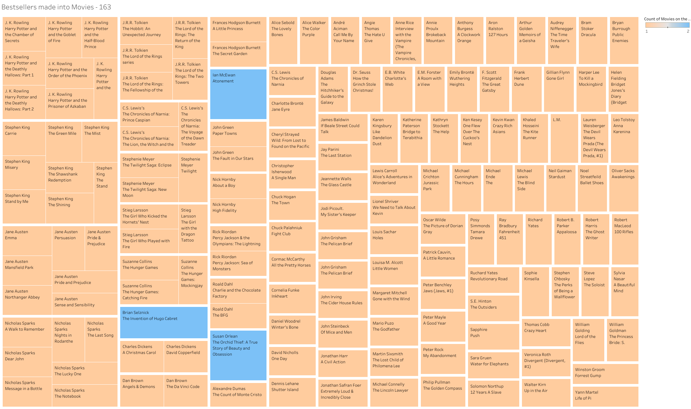
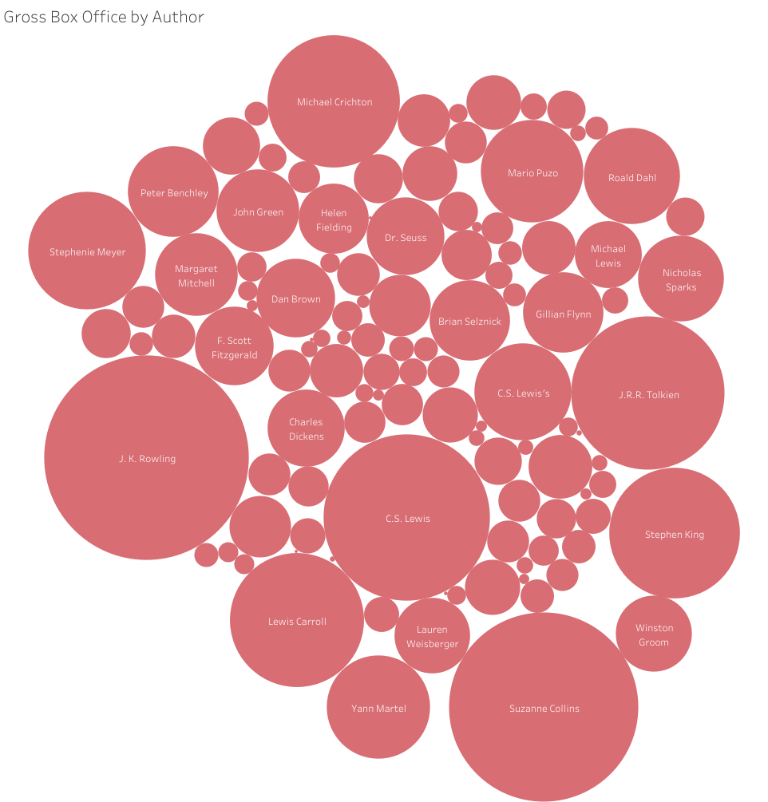
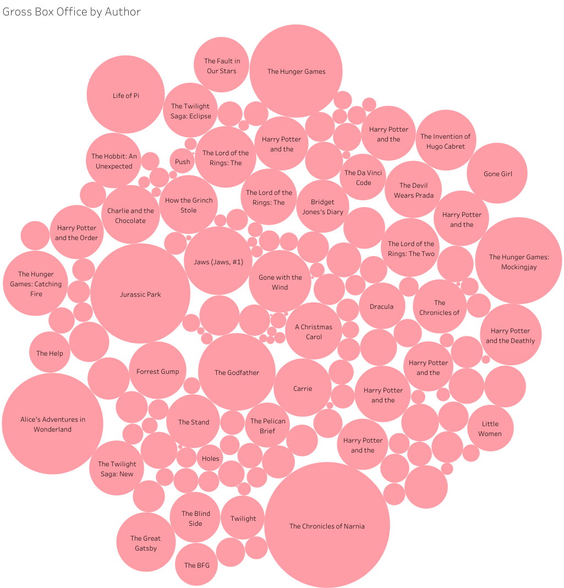
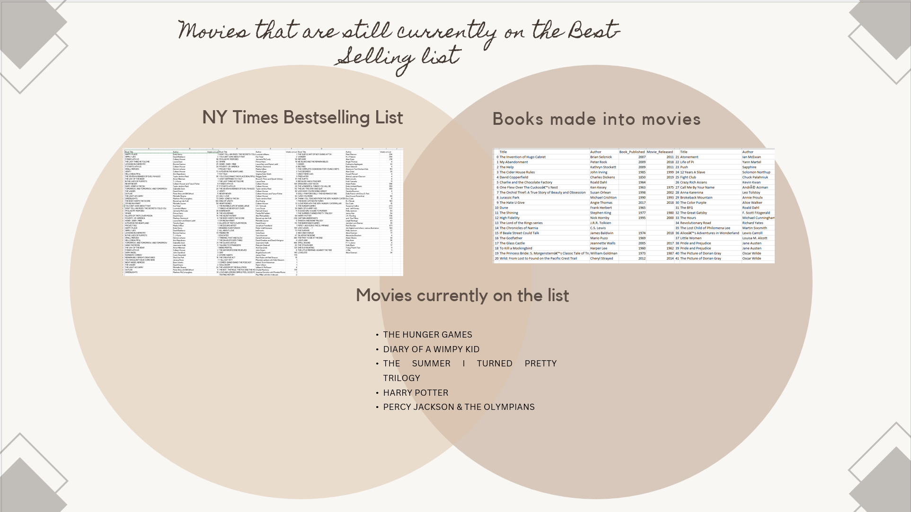

# Books vs Movies Data Analysis

## Project Overview
The purpose of this project is to analyze, **How many best selling books were made into movies**. Our reasoning for choosing this topic is because we wanted to analyze something that is fun and everyone can relate to.

Additional questions we hope to answer:

2. How many Books have been made into Movies vs series?
3. How many Books have been made into Movies have won awards?
4. Does the Movie of a Book impact the sale of the Book?

Project is being worked by Chanelle, Elizabeth and Katie

#### Team Roles

Elizabeth: IMDB scrape and clean - Movies based on novels and books

Chanelle: New York Times - scrape and clean, imported data to database

Katie: Reader's Digest & Goodreads scrape and clean, ERD

We all worked together on the database to create new tables and export the combined data to CSV to use for visuals in Tableau.

## Resources
- **Data Source**:
  - imdb_movies_from_books.csv (sourced from [IMDB](https://www.imdb.com/list/ls006444168/?sort=list_order,asc&st_dt=&mode=detail&page=1 "Movies based on novels and books"))
  - cleaned_books_movies.csv (sourced from [Reader's Digest](https://www.rd.com/list/hit-movies-that-were-books-first/))
  - NY_Times_Bestsellers.csv (sourced from [New York Times Best Sellers List](https://www.nytimes.com/books/best-sellers/))
  - Goodreads_books_with_genre.csv (sourced from [Kaggle_Dataset](https://www.kaggle.com/datasets/middlelight/goodreadsbookswithgenres "Goodread's books with genres"))
- **Languages**: Python 3.7.6, Jupyter Notebook
- **Packages**: Pandas, BeautifulSoup, Splinter
- **Software**: PostgreSQL 14.6, pgAdmin4 6.18, Atom 1.63.1, Visual Studio Code 1.74.1

## Results

> Chanelle worked on this portion.

> This portion was worked on as a team via Zoom

> Chanelle used this code to scrape the bestsellers list from the New York Times website. Chanelle requested the API to obtain the information

> Katie used this code to scrape this information from Reader's Digest website.

> Elizabeth used this code to scrape this information from an IMDb Movies made from books on their website.

## Summary

In summary, that data that we needed to answer our questions simply didn't exist, at least not all in one space. At any given time the New York Times Bestsellers list can have approximately 155 titles on it every week. The list is comprised of several categories to include:
- Combined Print & E-Book Fiction
- Combined Print & E-Book Nonfiction
- Hardcover Fiction
- Hardcover Nonfiction
- Trade Fiction Paperback
- Mass Market Paperback
- Paperback Nonfiction
- Advice, How-To & Miscellaneous
- Children's Middle Grade Hardcover
- Children's Picture Books
- Children's Series
- Young Adult Hardcover

With the variety of the categories for the list, this can cause some duplications across the lists. After scraping the NYTimes list via the API call, there were 231 books list, after some cleaning and removing of duplications we were left with 168 books on the list. Again, this list only consists of books that are considered bestsellers the week of May 3, 2023 when we pulled the data. When we cross referenced the list with the list of movies from IMDb and Reader's Digest lists of books made into movies, we were left with 15 books that are *currently* on the bestsellers list that were made into a movie. We were able to find another list of books made into movies on the Goodreads website that contained over 800 books, so we decided to manually add in some additional rows to a combined sheet, capping at **168** books/movies from the Best-Sellers list.

The challenges that we encountered included that the data did not exist and was limited to only open sourced information. For example, the NY Times list didn't exist until 1931, resulting many favorites such as "A Christmas Carol" by Charles Dickens published in 1843, not getting the opportunity to appear on The NYTimes Best-Seller list during its initial publication. Meaning, it's a movie from a book but not a best seller b/c most pop. books are not on the "list" due to capture time frame. Next, the data was subjective, some of the data is subjective to the proprietor NY Times & Goodreads are both subjective to the reviewers. "They" capture what they want to capture.
Finally, the list was duplicative, NYTimes has over 155 books at any given time, duplicating the results. There are other  opportunities to have duplicate data for example, Mansfield Park was released as a movie twice.

We were unable answer any of the original additional questions listed due to the limitations of the data that we collected. We identified additional questions to further analyze:
1. Does a best-seller affect the success of the movie?
2. Does a movie affect the success of a book?
3. Who would benefit having this information?
4. How many platforms do the movies exist on?
  - Example: Hulu, Netflix, AppleTV
