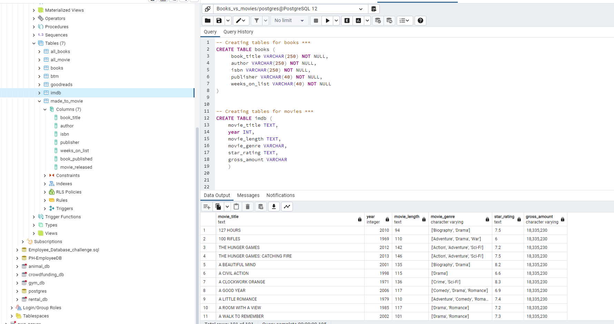
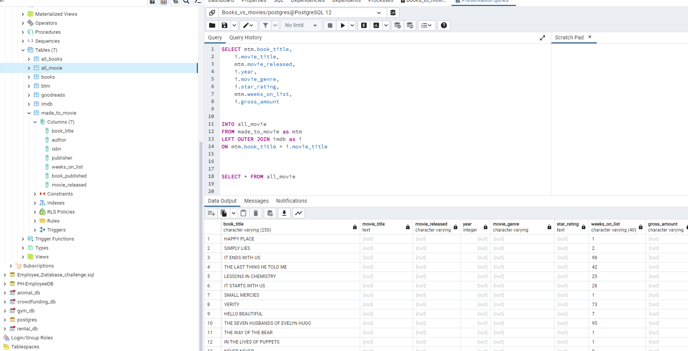
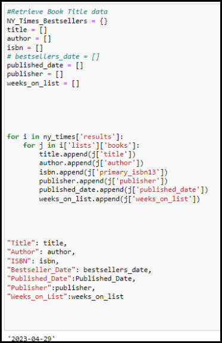
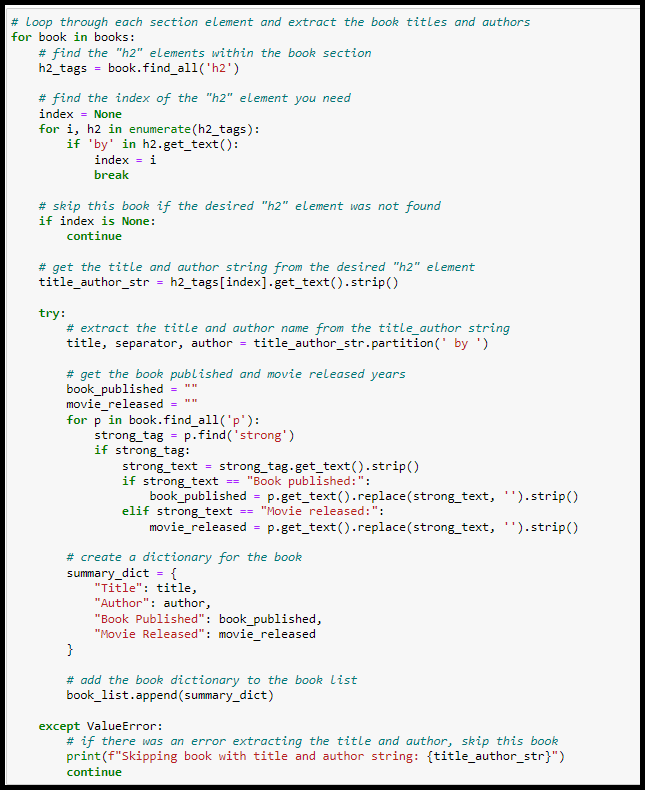
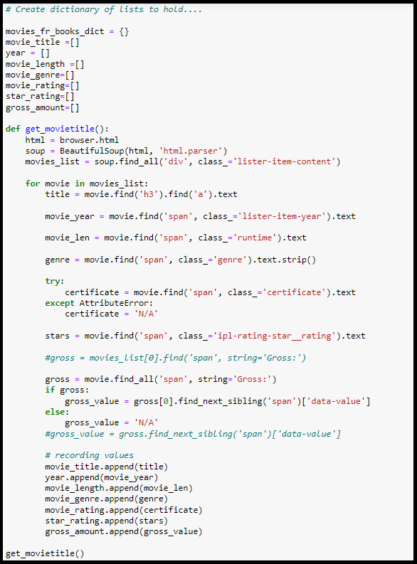
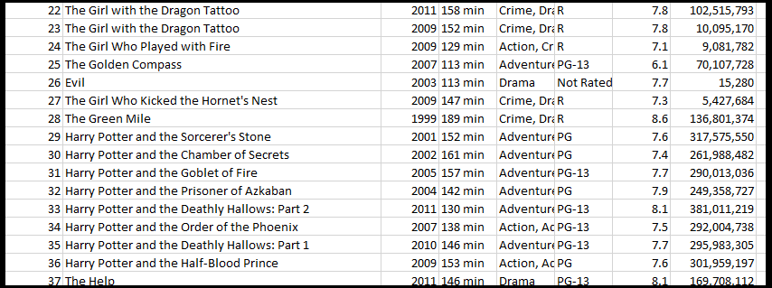

# Books vs Movies Data Analysis

## Project Overview
The purpose of this project is to analyze, **How many best selling books were made into movies**. Our reasoning for choosing this topic is because we wanted to analyze something that is fun and everyone can relate to.

Additional questions:
2. How many Books have been made into Movies vs series?
3. How many Books have been made into Movies have won awards?
4. Does the Movie of a Book impact the sale of the Book?

Project is being worked by Chanelle, Elizabeth and Katie

#### Team Roles

Elizabeth: IMDB scrape and clean - Movies based on novels and books

Chanelle: New York Times - scrape and clean, imported data to database

Katie: Reader's Digest & Goodreads scrape and clean, ERD

We all worked together on the database to create new tables and export the combined data to CSV to use for visuals in Tableau.

## Resources
- **Data Source**:
  - imdb_movies_from_books.csv (sourced from [IMDB](https://www.imdb.com/list/ls006444168/?sort=list_order,asc&st_dt=&mode=detail&page=1 "Movies based on novels and books"))
  - cleaned_books_movies.csv (sourced from [Reader's Digest](https://www.rd.com/list/hit-movies-that-were-books-first/))
  - NY_Times_Bestsellers.csv (sourced from [New York Times Best Sellers List](https://www.nytimes.com/books/best-sellers/))
  - Goodreads_books_with_genre.csv (sourced from [Kaggle_Dataset](https://www.kaggle.com/datasets/middlelight/goodreadsbookswithgenres "Goodread's books with genres"))
- **Languages**: Python 3.7.6, Jupyter Notebook
- **Packages**: Pandas, BeautifulSoup, Splinter
- **Software**: PostgreSQL 14.6, pgAdmin4 6.18, Atom 1.63.1, Visual Studio Code 1.74.1

## Results

> Chanelle worked on this portion.

> This portion was worked on as a team via Zoom

> Chanelle used this code to scrape the bestsellers list from the New York Times website. Chanelle requested the API to obtain the information

> Katie used this code to scrape this information from Reader's Digest website.

> Elizabeth used this code to scrape this information from an IMDb Movies made from books on their website.

## Summary
